# Cowork Booking: product requirements

Status: proposed (M2 draft), 2026-10-01. Rules live in [RULES.md](RULES.md), terms in [GLOSSARY.md](GLOSSARY.md), decisions D1 to D28 in [DECISIONS.md](DECISIONS.md), open questions in [OPEN_QUESTIONS.md](OPEN_QUESTIONS.md). This PRD adds no rule: every acceptance criterion cites one.

**Example data used below.** Clock 2026-10-05 10:00 Bangkok. Spaces: Meeting Room A (space_id 1, capacity 6, THB 300 per hour), Focus Pod 1 (2, capacity 2, THB 20 per hour), Board Room (3, capacity 12, THB 1,000 per hour), Community Table (4, capacity 8, free). Member A (a@example.com) pays by card; Member B (b@example.com) has plan_active. Standard booking BK-7KQ2M9: Member A, Meeting Room A, 2026-10-07 09:00-10:30, 3 blocks, party of 4, THB 450.00 (amount_satang 45000), hold until 10:15, payment session expires 10:13, ticket code H7K3-9QXA.

## 1. Problem

Member A wants Meeting Room A for 4 people on 2026-10-07 09:00-10:30. Today, 2026-10-05 10:00, she must see which starts are free, pay THB 450.00, and get one code that opens the door. If she cancels two days ahead, she expects THB 450.00 back.

The seed app does this badly (source inspected at 5a1cf3d):

| Today in the seed app | In Cowork Booking v1 | Rules |
|---|---|---|
| Any typed time, even in the past | 30-minute blocks, 08:00-20:00, 60 min to 30 days ahead | PUR-R08, PUR-R09, PUR-R10 |
| An unpaid booking blocks the slot forever | A 15-minute hold, then the slot is free | PUR-R12, PUR-R21, PUR-R24 |
| A THB 0.00 booking still asks for a card | Free and plan bookings skip Payment | PUR-R20 |
| A new door code on every unlock | One stored ticket code per booking | AXS-R05 |
| Cancel deletes the booking and its revenue | Cancel keeps the row, revokes the ticket, refunds by policy | PUR-R28, PUR-R30, PUR-R32 |
| Anyone sees any booking | Owner or Operator only; others get 404 | PUR-R05, PUR-R06 |

Goal: a Member books a free slot, pays once, and gets in with one code. The Operator sees and fixes every booking, refund and ticket. Success is measured by the dashboard metrics (PUR-R34) and Payment's totals (PMT-R17); see [BUSINESS_MODEL.md](BUSINESS_MODEL.md).

## 2. Roles

People and the Browser sit outside the three services.

| Role | Example | Uses | Signs in with |
|---|---|---|---|
| Member | Member A, Member B, Member C | Purchase pages, the Payment hosted page, the Access e-ticket | Email and password on Purchase; cookie purchase_session, 12 h |
| Operator | The Member whose email equals OPERATOR_EMAIL | Purchase operator pages; the Payment operator page | Purchase login; HTTP Basic with OPERATOR_PASSWORD on Payment |
| Staff | The person at the room door | The Access check-in kiosk | HTTP Basic with STAFF_PASSWORD; no Member account |
| Browser | Member A's browser | Follows 303 redirects Purchase to Payment to Purchase; opens the ticket link | One cookie per service, HttpOnly, SameSite=Lax |

| Service | Port | Owns | Calls |
|---|---|---|---|
| Purchase | 8001 | Members, spaces, availability, bookings, price, coverage, cancellation, dashboard | Payment and Access, with bearer tokens and a 5 s timeout |
| Payment | 8002 | Payment sessions, attempts, refunds, money totals | Nobody |
| Access | 8003 | Grants, ticket codes, the e-ticket, the kiosk and its scan log | Nobody |

- Three services are the course exercise, not a claim that every growing business should split (ADR-0001).
- Account data lives on Member in Purchase; there is no Identity service (ADR-0002).
- Each service has its own database and never reads another's (ADR-0003).
- Only Purchase calls; there are no webhooks (ADR-0004).

## 3. Scope and non-goals

**In v1**
- Member sign-up, login and logout in Purchase.
- Spaces with capacity and an hourly rate; operator create, edit and archive.
- A start-block grid per space, date and duration; party size and an optional note.
- A price fixed at creation; coverage pay, plan or free.
- A 15-minute hold and a hosted mock checkout with test cards.
- One stored grant per confirmed booking: e-ticket with a QR and a readable code.
- A check-in kiosk with a mock lock and a scan log.
- Cancellation with 0% or 100% refunds, revoke and retry.
- Operator tools: all bookings, Retry, Reconcile, plan toggle, dashboard; Payment's operator page with totals.

**Not in v1**

| Not in v1 | What happens instead | Recorded in |
|---|---|---|
| Plan sales | The Operator switches plan_active by hand | D10, PUR-Q02 |
| Host payouts | Commission is an estimate on Payment's operator page | D25, PMT-Q04 |
| Real payments | Mock checkout with test cards; no real money | ADR-0018, PMT-Q01 |
| Real door locks | The kiosk shows "Door unlocked (mock)" | ADR-0017, AXS-Q02, PUR-Q06 |
| Email | No confirmation email and no emailed ticket; the ticket link is on the booking page | PUR-Q04, AXS-Q03 |
| Reschedule | Cancel and book again | D18, PUR-Q03, AXS-Q05 |
| Partial cancel | Cancel the whole booking | D18, PUR-Q03 |
| Identity service | Account data on Member in Purchase | ADR-0002 |
| Webhooks | Purchase reconciles when it touches a held booking | D12, D13, ADR-0004 |
| Cleaning gap | 0 min; back-to-back bookings allowed | D6, PUR-Q01 |
| Login and kiosk rate limits | None; every scan is logged | PUR-Q05, AXS-Q04 |

## 4. User stories

Read each criterion as a check. The rule IDs in brackets say which rule proves it; section 4.4 shows every rule is reached.

| Role | Stories |
|---|---|
| Member | US1 to US13 |
| Operator | US14 to US22 |
| Staff | US23 to US25 |

## 4.1 Member stories

### US1 Register, log in and log out

As a Member, I want an account with my email and a password, so that my bookings are mine and nobody else sees them.

- AC1.1 Sign up at /register with email, display name and password: " A@Example.com " is stored as a@example.com, and the page says "Registered. Please log in." (PUR-R01)
- AC1.2 A 7-character password gets "Password must be at least 8 characters"; a blank display name gets "Display name is required"; nothing is stored. (PUR-R01)
- AC1.3 Signing up with a registered email says "Email already registered". This reveals that the address exists: an accepted trade-off (D16, ADR-0016). (PUR-R01)
- AC1.4 Log in at /login with the email in any letter case. A wrong password and an unknown email both get "Invalid email or password". (PUR-R02)
- AC1.5 A login lasts 12 h whatever the activity: log in at 10:00, and at 22:00 the next page says "Please log in again". The purchase_session cookie is HttpOnly and SameSite=Lax, plus Secure on https. (PUR-R03)
- AC1.6 A copy of the cookie replayed after logout still works until the 12 h end: an accepted trade-off (D15, ADR-0016). (PUR-R03)
- AC1.7 "Log out" is a POST to /logout: it clears the cookie and says "Logged out". A GET /logout changes nothing (405). (PUR-R37)
- AC1.8 Pressing "Continue to payment" while logged out goes to login with "Log in to book"; over JSON it gets 401. Nothing is created. (PUR-R05)
- AC1.9 Every form result is a one-time flashed message. Text in the URL (?error=, ?message=, ?code=) is never shown. (PUR-R36)

### US2 Browse spaces

As a Member, I want to see every room with its capacity and price, so that I pick one that fits my group and budget.

- AC2.1 GET / lists each space with name, capacity and price: "Meeting Room A, up to 6, THB 300.00 per hour, THB 150.00 per 30 min". (PUR-R15, PUR-R18)
- AC2.2 Community Table shows "THB 0.00 per hour"; its bookings are free. (PUR-R18, PUR-R19)
- AC2.3 An archived space is not listed and cannot be booked (404). Its past bookings still show. (PUR-R16)
- AC2.4 GET /api/spaces returns the same list, with hourly_rate_satang as an integer such as 30000. (PUR-R18)

### US3 Pick a date, a duration and a start block

As a Member, I want a grid of starts that are really free for my duration, so that I only pick slots I can book.

- AC3.1 On 2026-10-05 the date input allows 2026-10-05 to 2026-11-04. Any other date gets "Pick a date from today to 30 days ahead" (400 over JSON). (PUR-R10, PUR-R13)
- AC3.2 Duration is 1 to 8 blocks (30 min to 4 h). The grid lists 24 starts, 08:00 to 19:30, each on :00 or :30. (PUR-R09, PUR-R13)
- AC3.3 Meeting Room A, 2026-10-07, 3 blocks, no bookings: 08:00 to 18:30 are buttons; 19:00 and 19:30 are disabled with the title "Runs past 20:00". (PUR-R08, PUR-R13)
- AC3.4 Today at 10:00, 1 block: 08:00 to 10:30 are disabled "Too soon"; 11:00, exactly 60 min ahead, is free. The first reason that applies wins: "Too soon", then "Runs past 20:00", then "Booked". (PUR-R10, PUR-R13)
- AC3.5 BK-7KQ2M9 confirmed 09:00-10:30, 2 blocks chosen: 08:00 and 10:30 are free (no gap between bookings); 08:30 to 10:00 are "Booked". (PUR-R11, PUR-R12)
- AC3.6 A held booking blocks its slot only until hold_expires_at. At 10:16 a hold that ended at 10:15 no longer greys 09:00. Expired and cancelled bookings never block. (PUR-R12)
- AC3.7 The form sends a date and a block; the server builds 2026-10-07T09:00:00+07:00 and pages show "2026-10-07 09:00". JSON needs an offset: "2026-10-07T09:00:00" gets 400 "Time needs an offset, for example +07:00" (ADR-0012). (PUR-R07)
- AC3.8 A crafted start of 09:15 gets "Pick a start on the half hour" (form) or 400 "Start on :00 or :30" (JSON). 19:30 for 2 blocks gets "Outside opening hours 08:00-20:00". (PUR-R09, PUR-R08)
- AC3.9 GET /api/spaces/1/availability?date=2026-10-07&blocks=3 returns the same 24 starts, each with available and, when false, a reason. (PUR-R13)

### US4 Give party size and a note

As a Member, I want to say how many people come and add a note, so that the room fits and the Operator knows what I need.

- AC4.1 Party size is offered from 1 to the room's capacity: 1 to 6 for Meeting Room A. 0 or 7 gets "Party size must be 1 to 6". (PUR-R14)
- AC4.2 A booking is the whole room: a party of 1 still takes Meeting Room A, and an overlapping request gets "Slot just taken". (PUR-R14, PUR-R12)
- AC4.3 Name and email come from the logged-in Member; the form never asks for them. (PUR-R05)
- AC4.4 The note is optional. Nothing personal goes to Payment: the session description is "Meeting Room A, 2026-10-07 09:00-10:30", never a name or an email. (PUR-R23)

### US5 Review the price

As a Member, I want the exact price and its coverage before I commit, so that there are no surprises.

- AC5.1 Meeting Room A for 3 blocks shows "THB 450.00" before "Continue to payment": 30000 satang per hour x 3 blocks / 2 = 45000. (PUR-R17)
- AC5.2 The price is fixed at creation. If the Operator then sets THB 400 per hour, BK-7KQ2M9 stays THB 450.00 and Payment is asked for 45000. An amount sent by the client is ignored. (PUR-R17, PMT-R04)
- AC5.3 Amounts are integer satang, shown as "THB 1,234.50"; JSON sends agreed_price_satang 45000, never 450.0. (PUR-R18)
- AC5.4 Coverage is set at creation and shown on review. Pay: "THB 450.00". Plan: "THB 450.00, covered by your plan. No payment needed." Free: "THB 0.00". The order is free if the price is 0, else plan if plan_active, else pay. (PUR-R19)

### US6 Continue to payment

As Member A, I want "Continue to payment" to hold my slot and open the checkout, so that nobody takes the room while I pay.

- AC6.1 Member A presses "Continue to payment" at 10:00: Purchase creates BK-7KQ2M9, status held, hold until 10:15, and sends the browser (303) to the Payment hosted page. POST /api/bookings answers 201 with payment_url. (PUR-R21)
- AC6.2 The reference is BK- plus 6 symbols without 0, O, 1, I, L or U, such as BK-7KQ2M9, and it is unique. (PUR-R29)
- AC6.3 Purchase asks Payment for a session: amount_satang 45000, currency THB, expires_at 10:13 (hold minus 2 min), success_url /bookings/BK-7KQ2M9/return, cancel_url /bookings/BK-7KQ2M9. (PUR-R23, PMT-R02)
- AC6.4 Pressing again for the same space and time at 10:05 resumes BK-7KQ2M9: same reference, same hosted page, no second booking, no second session. (PUR-R21, PMT-R03)
- AC6.5 Checks run in order: bad input gets 400; another held booking gets 409 "Finish or cancel your held booking BK-7KQ2M9 first", for plan and free requests too; a taken slot gets 409 "Slot just taken". (PUR-R39, PUR-R12)
- AC6.6 Two Members send the same free slot at the same instant: one gets it, the other sees "Slot just taken". Stale holds in that space are reconciled before the insert. (PUR-R22)
- AC6.7 Payment gives no answer at create: BK-7KQ2M9 stays held without a session, and the page says "Payment is not reachable. Please try again." (503 over JSON). Pressing again for the same slot retries (PUR-Q09). (PUR-R23, PUR-R35)
- AC6.8 Purchase calls Payment with Bearer PAYMENT_API_TOKEN and a 5 s timeout, never inside an open database transaction (ADR-0019). (PUR-R35, PMT-R01)

### US7 Pay on the hosted page

As Member A, I want a simple checkout that shows what I pay for, so that I pay by card and get back to my booking.

- AC7.1 /pay/ps_... shows "THB 450.00", "Booking BK-7KQ2M9", "Meeting Room A, 2026-10-07 09:00-10:30", "Pay by 10:13 (12 min left)", a test-mode banner with the 6 test cards, the card form (number, MM/YY, CVC), Pay and Back. No login is asked (ADR-0018). (PMT-R07)
- AC7.2 Card 4242424242424242, 12/28, CVC 123 at 10:04: the session completes and the browser goes (303) to /bookings/BK-7KQ2M9/return?session_id=ps_...; the booking page then shows "Confirmed". (PMT-R09, PMT-R10, PUR-R24)
- AC7.3 Purchase confirms only a paid session whose booking reference, amount 45000 and currency THB equal the booking's. It ignores session_id in the URL and reads its own stored session. (PUR-R25, PUR-R24)
- AC7.4 On a mismatch Purchase cancels the booking with reason amount_mismatch, refunds the session in full and issues no ticket. (PUR-R25)
- AC7.5 Card fields are checked first, in order: "card_number must be 13-19 digits", "cvc must be 3 or 4 digits", "expiry must be in MM/YY format", "card has expired". No attempt is stored and the fields come back empty. (PMT-R08, PMT-R13)
- AC7.6 A double click on Pay charges once: THB 450.00 is collected, not THB 900.00. Pay on a paid session goes straight to success_url. (PMT-R12)
- AC7.7 Payment keeps only the brand and last4, "visa ending 4242"; never the number, expiry or CVC, not in logs, messages or URLs (ADR-0020). (PMT-R13)
- AC7.8 Back goes to /bookings/BK-7KQ2M9 and changes nothing; the same pay link works until 10:13. (PMT-R07)
- AC7.9 The payment_session cookie is HttpOnly and SameSite=Lax, plus Secure on https, and carries only flashed messages. (PMT-R19)
- AC7.10 No real money moves. The test card alone decides the outcome; an extra field such as force_failure is ignored. (PMT-R09, PMT-R20)

### US8 Decline and retry

As Member A, I want to see why my card was declined and try again, so that one bad card does not cost me the slot.

- AC8.1 Card 4000000000000002 shows "Your card was declined." on the pay page (data-decline-code="generic_decline"). The session stays open and BK-7KQ2M9 stays held. (PMT-R10, PMT-R09)
- AC8.2 The other test declines: 4000000000009995 insufficient_funds, 4000000000000069 expired_card, 4000000000000119 processing_error. Any other valid-looking number, such as 4111111111111111, gets generic_decline. (PMT-R09)
- AC8.3 A retry with 4242424242424242 at 10:03 succeeds. There is no retry limit before 10:13. (PMT-R10)
- AC8.4 After a decline Member A is still logged in on Purchase, and the pay URL carries no error text and no card data. (PUR-R03, PMT-R10)

### US9 Hold countdown and expiry

As Member A, I want to see how long I have to pay, so that I know when my slot is released.

- AC9.1 The booking page of a held booking counts down to the payment deadline, "Pay by 10:13", not 10:15, and offers "Continue to payment" and Cancel. (PUR-R40)
- AC9.2 From 10:13 Payment refuses every attempt, even from a page loaded earlier: "This payment session has expired." Nothing is charged. (PMT-R11, PMT-R05)
- AC9.3 From 10:13 to 10:15 "Continue to payment" for that hold says "Time to pay has run out; you can book again after 10:15". The hold still blocks its slot and Member A's other requests. (PUR-R40, PUR-R39)
- AC9.4 From 10:15 the grid shows the slot free. The next time Purchase touches BK-7KQ2M9 (booking page, My bookings, cancel, the pre-insert sweep, Reconcile) it finds the session unpaid and marks the booking expired (ADR-0007). (PUR-R24, PUR-R12)
- AC9.5 Member A paid at 10:12 and closed the tab: the next touch confirms BK-7KQ2M9, even after 10:15. A paid session beats a lapsed hold. (PUR-R24, PUR-R25)
- AC9.6 Payment gives no answer: the booking page shows "Payment status unknown, refresh later" and nothing changes. (PUR-R24)

### US10 Plan and free bookings skip payment

As Member B with a plan, or any Member booking a free room, I want the booking confirmed at once, so that I never see a card form for nothing.

- AC10.1 Member B books Meeting Room A 2026-10-07 11:30-13:00: confirmed at once, coverage plan, price THB 450.00 stored, and the page says "Confirmed. Covered by your plan. No payment was taken." No redirect to Payment. (PUR-R20, PUR-R19)
- AC10.2 Member A books Community Table: coverage free, THB 0.00, confirmed; JSON payment_url is null. (PUR-R20)
- AC10.3 Neither makes a Payment call; the grant is requested at once. (PUR-R20, PUR-R26)
- AC10.4 Focus Pod 1 for 1 block costs THB 10.00, so it is not free: it is held and paid like any pay booking. Payment refuses amounts below THB 10.00. (PUR-R20, PMT-R02)
- AC10.5 Coverage never changes later. Turning Member B's plan off keeps existing plan bookings plan; turning Member A's plan on during a hold leaves that hold pay. (PUR-R19)

### US11 Booking page and e-ticket

As Member A, I want one page for my booking and a ticket I can show at the door, so that I can get in.

- AC11.1 /bookings/BK-7KQ2M9 shows status, reference, "2026-10-07 09:00-10:30", "THB 450.00", coverage, payment outcome and "View e-ticket". (PUR-R05, PUR-R28)
- AC11.2 Only Member A and the Operator see it. Member B gets 404, the same as for an unknown reference. (PUR-R05)
- AC11.3 On confirmation Purchase asks Access for the grant with valid_from 2026-10-07T09:00:00+07:00 and valid_until 2026-10-07T10:30:00+07:00: no early entry. (PUR-R26, PUR-R27, AXS-R03)
- AC11.4 Access gives no answer: the booking stays confirmed and the page says "Your e-ticket is being prepared". Opening the page retries; there is still one grant. (PUR-R26, AXS-R01)
- AC11.5 The e-ticket at /t/<ticket_token> shows Meeting Room A, 2026-10-07 09:00-10:30, "Check-in 09:00-10:30", the badge Issued, H7K3-9QXA in large text, a QR of exactly H7K3-9QXA, and "Booking ref (not for entry) BK-7KQ2M9" in small type. It prints on one page (ADR-0010). (AXS-R10, AXS-R07, AXS-R08)
- AC11.6 The code is 8 symbols shown XXXX-XXXX and never starts with BK. It is issued once: every view, printout and repeat request shows H7K3-9QXA. (AXS-R06, AXS-R05)
- AC11.7 The ticket link is a view-only bearer link: no login, no email, no buttons. Whoever has it can read the code; a made-up token gets 404 (ADR-0008). (AXS-R09)
- AC11.8 The badge follows the state and the clock: Issued, Checked in, Expired (from 10:30), or Cancelled with a CANCELLED overlay. (AXS-R10, AXS-R16)
- AC11.9 From 2026-10-07 10:30 the booking shows "Completed"; the stored status stays confirmed and JSON says "completed": true. No booking is ever deleted. (PUR-R28)

### US12 My bookings

As Member A, I want a list of my bookings, so that I find upcoming tickets and past visits.

- AC12.1 /bookings/mine lists Member A's bookings only, upcoming then past, each with reference, room, time, status and a link. GET /api/bookings/mine returns the same. (PUR-R05)
- AC12.2 Opening the list reconciles each held booking that has a session: paid becomes confirmed, unpaid after the hold becomes expired. A GET makes no other change. (PUR-R24, PUR-R37)
- AC12.3 BK-7KQ2M9 moves to past as "Completed" at 2026-10-07 10:30. Cancelled and expired bookings stay in the list. (PUR-R28)
- AC12.4 Logged out, the page asks to log in first; JSON gets 401. (PUR-R05)

### US13 Cancel with the refund shown first

As Member A, I want to see the refund before I confirm a cancel, so that I decide knowing the cost.

- AC13.1 Cancel on confirmed BK-7KQ2M9 at 2026-10-05 11:00 (46 h ahead) shows "Refund THB 450.00 (100%)" at GET /bookings/BK-7KQ2M9/cancel. After the POST, the booking is cancelled and THB 450.00 refunded. (PUR-R30)
- AC13.2 At 2026-10-06 09:00, exactly 24 h ahead, the refund is still 100%; at 09:01 the screen shows "Refund THB 0.00 (0%)". (PUR-R30)
- AC13.3 From 2026-10-07 09:00 (the start) there is no Cancel button; a post gets "This booking has started; ask the operator". (PUR-R30)
- AC13.4 Plan and free bookings show "No payment was taken"; the refund is 0 and Payment is not called. (PUR-R30)
- AC13.5 Held booking: the screen says "No payment has been taken. If your payment already went through, the refund follows the policy:" and the amount. Purchase first expires the session; unpaid inside the hold, the booking becomes cancelled with no refund; after the hold, it becomes expired with "This hold has already expired". (PUR-R31, PMT-R06)
- AC13.6 Member A paid in another tab: expire reports paid, so Purchase confirms without a ticket and cancels under AC13.1 and AC13.2. The revoke leaves a tombstone in Access, so no ticket is ever issued. (PUR-R31, AXS-R02)
- AC13.7 Payment gives no answer: the cancel is refused with "Payment is not reachable. Please try again." and the booking stays held. (PUR-R31)
- AC13.8 A confirmed cancel runs three stored steps: commit cancelled with the refund amount, revoke the grant, then refund. The e-ticket then shows CANCELLED and H7K3-9QXA answers revoked at the kiosk. (PUR-R32, AXS-R17)
- AC13.9 A step with no answer shows "Revocation pending" or "Refund pending". Opening the page or Retry (POST /bookings/BK-7KQ2M9/retry) repeats it, revoke first; the refund waits for the revoke (PUR-Q10). No double refund (ADR-0014). (PUR-R32, PMT-R14)
- AC13.10 A refund that Payment answers failed (test card 4000000000005126) shows "Refund failed. The operator will follow up."; Member A gets no Retry for it. (PUR-R33, PMT-R16)
- AC13.11 A cancelled booking stays: Member A still opens it and sees status cancelled (200). (PUR-R28, PUR-R05)

## 4.2 Operator stories

### US14 Become the Operator

As the Operator, I want my account promoted by configuration, so that nobody makes themselves Operator from a page.

- AC14.1 The Member whose email equals OPERATOR_EMAIL, in any case, becomes Operator at sign-up or login; operator links appear. (PUR-R04)
- AC14.2 No other path promotes, and nothing demotes automatically. Register that address right after first start: until email confirmation exists, whoever registers it first is promoted (PUR-Q04). (PUR-R04)
- AC14.3 Operator pages answer a Member with 404 and a logged-out visitor with the login step (JSON 401). (PUR-R06)

### US15 Manage spaces

As the Operator, I want to create, edit and archive spaces, so that the list matches the rooms we rent.

- AC15.1 Create "Meeting Room A", capacity 6, THB 300 per hour at /operator/spaces; it shows "THB 300.00 per hour, THB 150.00 per 30 min". (PUR-R15, PUR-R06)
- AC15.2 The rate is whole THB, 0 or 20 to 10,000; capacity is 1 to 1,000; the name is not blank. Bad values return the form with "Rate must be 0 or 20 to 10,000 THB per hour" or "Capacity must be a whole number from 1 to 1,000", never a 500. (PUR-R15)
- AC15.3 Edit with POST /operator/spaces/1. A new rate or a lower capacity never changes existing bookings: BK-7KQ2M9 keeps THB 450.00 and its party of 4. (PUR-R14, PUR-R17)
- AC15.4 Archive with POST /operator/spaces/1/archive works only when no held or confirmed booking ends after now; otherwise "Cancel its upcoming bookings first". An archived space is hidden and keeps its history; no space is deleted. (PUR-R16)

### US16 See all bookings and cancel any

As the Operator, I want every booking in one list with a Cancel action, so that I can handle any request.

- AC16.1 /operator/bookings lists every booking with its status and Cancel. Retry shows only where a step is pending or failed; a pending revoke is flagged "Revocation pending" (PUR-Q12). (PUR-R06, PUR-R32)
- AC16.2 The Operator cancels a confirmed booking before its end, always at 100%: at 2026-10-07 10:00 BK-7KQ2M9 is refunded THB 450.00. At 10:30 it has ended: "This booking has ended". (PUR-R30)
- AC16.3 The cancel runs the same three steps with reason operator_cancel. A checked-in ticket stops at once: a scan at 09:35 after a 09:30 cancel answers revoked. (PUR-R32, AXS-R16)
- AC16.4 The Operator opens any booking page; a Member opens only their own. (PUR-R05)

### US17 Retry pending grant, revoke and refund

As the Operator, I want one Retry for any step that did not finish, so that every cancel and every ticket reaches its end state.

- AC17.1 Retry on "being prepared" sends the grant request again (POST /operator/bookings/BK-7KQ2M9/retry). The ticket link appears; there is still one grant and one code. (PUR-R26, AXS-R01)
- AC17.2 Retry on "Revocation pending" revokes (a repeat revoke changes nothing), then sends the waiting refund. (PUR-R32, AXS-R17)
- AC17.3 Retry on "Refund pending" repeats the same attempt number; if the first call landed, Payment returns the stored result. No double refund. (PUR-R32, PMT-R14)
- AC17.4 Retry on a failed refund (card 4000000000005126, attempt 1 failed) sends attempt 2 for the full amount, and it succeeds. A double click repeats attempt 2; the total refunded never exceeds the amount collected. (PUR-R33, PMT-R15, PMT-R16)
- AC17.5 Only the Operator starts attempt+1, with POST /operator/bookings/BK-7KQ2M9/retry; a non-operator gets 404 there. A Member's POST /bookings/BK-7KQ2M9/retry answers 303 to /bookings/BK-7KQ2M9, starts no attempt 2, and the page keeps "Refund failed. The operator will follow up." Nothing retries a failed refund on its own. (PUR-R33)
- AC17.6 Retry is a POST; a GET to the Retry URL changes nothing (405). (PUR-R37)

### US18 Reconcile held bookings

As the Operator, I want to reconcile a held booking on demand, so that a lost redirect or a lapsed hold never stays unresolved.

- AC18.1 Reconcile (POST /operator/bookings/BK-7KQ2M9/reconcile) reads the session: paid becomes confirmed and the grant is requested; unpaid after the hold becomes expired; unpaid inside the hold is unchanged. (PUR-R24)
- AC18.2 A paid session whose booking is already expired is refunded in full with reason slot_unavailable. (PUR-R25)
- AC18.3 Payment and Access never call Purchase; reconciling is how Purchase learns a lost payment (ADR-0004). (PUR-R35, PMT-R18)
- AC18.4 Payment gives no answer: nothing changes. (PUR-R24)

### US19 Toggle a Member's plan

As the Operator, I want to switch a Member's plan on or off, so that plan Members book without paying.

- AC19.1 /operator/members lists Members. POST /operator/members/18/plan with no field toggles plan_active (the button sends no field). With plan_active=true or plan_active=false it sets that value, so a repeat changes nothing. (PUR-R06)
- AC19.2 Only bookings created after the change use the new value; existing bookings keep their coverage. (PUR-R19)
- AC19.3 A plan has no price and no end date; plans are not sold in v1 (PUR-Q02). (PUR-R19)
- AC19.4 A Member cannot switch their own plan: 404. (PUR-R06)

### US20 Dashboard

As the Operator, I want last week's bookings and use in one place, so that I see how the rooms are doing.

- AC20.1 /dashboard at 2026-10-08 10:00 covers 2026-10-02 00:00 to 2026-10-09 00:00 Bangkok; a booking belongs by its start (PUR-Q11). (PUR-R34)
- AC20.2 It shows bookings by status, counted members and utilization. Example: confirmed 2, expired 1; members 2; 3.5 h over 4 spaces is 3.5 / 336 = 1.0%. Member A with two bookings counts once. (PUR-R34)
- AC20.3 Plan and free bookings count as bookings and hours, never as revenue. The dashboard shows no money; money is on Payment's operator page. (PUR-R34)
- AC20.4 A Member gets 404; a logged-out visitor gets the login step. (PUR-R06)

### US21 Payment operator page

As the Operator, I want Payment's totals and failed refunds on one page, so that I know what was collected and what needs follow-up.

- AC21.1 GET /operator on Payment asks for HTTP Basic (user operator, OPERATOR_PASSWORD); a wrong or missing password gets 401. The Purchase login does not open it (ADR-0019). (PMT-R17)
- AC21.2 It lists sessions, attempts with brand and last4 only, and refunds. (PMT-R17, PMT-R13)
- AC21.3 Totals: collected THB 1,450.00, refunded THB 450.00, net THB 1,000.00, "estimated platform commission (20% of net)" THB 200.00. (PMT-R17)
- AC21.4 A failed refund is listed "needs manual follow-up" until a later attempt for the same session succeeds (PMT-Q02). A refund never changes the session's status. (PMT-R16, PMT-R17)
- AC21.5 Refunds never exceed collected: after THB 450.00 is refunded on BK-7KQ2M9, one more satang gets 409. (PMT-R15)
- AC21.6 Plan and free bookings never appear: they never reach Payment. (PMT-R04)

### US22 Run the three services safely

As the Operator, I want each service to refuse unsafe settings and unknown callers, so that a bad deploy fails loudly instead of leaking.

- AC22.1 Each service refuses to start without SECRET_KEY: "SECRET_KEY is required". (PUR-R03, PMT-R19, AXS-R18)
- AC22.2 Payment API calls need Bearer PAYMENT_API_TOKEN and Access API calls need Bearer ACCESS_API_TOKEN; anything else gets 401 before any validation. A service refuses to start without its token (ADR-0019). (PMT-R01, AXS-R04)
- AC22.3 Payment and Access make no outbound call and read no other database (ADR-0003, ADR-0004). (PMT-R18, AXS-R04, PUR-R35)
- AC22.4 POST /_test/clock answers 404 unless TEST_CLOCK_ENABLED=true, which only the e2e compose file sets. With it, {"now": "2026-10-05T10:15:00+07:00"} moves time and {"now": null} clears it (ADR-0013). (PUR-R38, PMT-R20, AXS-R19)
- AC22.5 A form on another site cannot book or cancel: cookies are SameSite=Lax and every state change is a POST (ADR-0009). (PUR-R37, PUR-R03)

## 4.3 Staff stories

### US23 Select the room at the kiosk

As Staff, I want to set my room once, so that each scan is checked against the right door.

- AC23.1 /checkin asks for HTTP Basic (user staff, STAFF_PASSWORD); a wrong password gets 401. (AXS-R11)
- AC23.2 Staff picks the room from rooms seen in grants, such as Meeting Room A. Before any ticket exists: "No rooms yet: a room appears after its first ticket is issued". (AXS-R11)
- AC23.3 POST /checkin with space_id=1 and no code selects Meeting Room A. The room stays in the access_session cookie (HttpOnly, SameSite=Lax) until Staff changes it. A scan is a second POST with code only; a space_id sent with a code is ignored. A scan with no room gets "Select the room first", even when the POST carries a space_id. (AXS-R11, AXS-R18)
- AC23.4 Access never asks Purchase for rooms. (AXS-R11, AXS-R04)

### US24 Check a code in

As Staff, I want a clear answer for every scan, so that I let the right people in.

- AC24.1 Scan the QR or type the code. " h7k3 9qxa " becomes H7K39QXA; look-alikes are not corrected (H7K3-9OXA is unknown_code). (AXS-R12)
- AC24.2 At Meeting Room A on 2026-10-07 at 09:00, H7K3-9QXA gets ok "Door unlocked (mock)" (data-result="ok"). At 09:40 it gets ok again: re-entry is allowed. (AXS-R13)
- AC24.3 At 08:59: not_open_yet "opens 09:00". On 2026-10-05: "opens 2026-10-07 09:00". At 10:30: closed "Check-in closed at 10:30". (AXS-R13)
- AC24.4 Checks run in order and stop at the first failure: unknown_code "Code not recognised", revoked "This ticket was cancelled", wrong_room "This ticket is for Meeting Room A", then the window. (AXS-R14)
- AC24.5 Typing BK-7KQ2M9 or the ticket token gets unknown_code: neither is an entry credential. (AXS-R08, AXS-R09)
- AC24.6 The first ok scan makes the grant checked_in. ok means every check passed, not that a door opened: the lock is mocked (ADR-0017). (AXS-R16)
- AC24.7 The result shows large after a redirect, from a flashed message; /checkin?error=ok shows nothing. (AXS-R14)

### US25 See the last 10 scans

As Staff, I want the recent scans on screen, so that I can answer "did my friend get in?".

- AC25.1 The kiosk lists the last 10 scans at the selected room, newest first, such as "09:05 ••••-9QXA ok". (AXS-R15)
- AC25.2 Unknown codes are logged too (BK-7KQ2M9 shows as ••••-Q2M9). Only the last 4 symbols show; older scans stay stored. (AXS-R15)

## 4.4 Rule coverage

Every rule in RULES.md and the stories whose criteria cite it.

| Rule | Stories |
|---|---|
| PUR-R01 Register a Member | US1 |
| PUR-R02 Log in with one uniform error | US1 |
| PUR-R03 A login session ends 12 hours after login | US1, US8, US22 |
| PUR-R04 Promote the operator by OPERATOR_EMAIL | US14 |
| PUR-R05 Log in to book; see only your own bookings | US1, US4, US11, US12, US13, US16 |
| PUR-R06 Operator pages are for operators only | US14, US15, US16, US19, US20 |
| PUR-R07 Times carry an offset; the form sends a date and a block | US3 |
| PUR-R08 Book inside opening hours | US3 |
| PUR-R09 Start on the half hour; book 1 to 8 blocks | US3 |
| PUR-R10 Book at least 60 minutes ahead and at most 30 days out | US3 |
| PUR-R11 No gap between bookings | US3 |
| PUR-R12 Only slot-blocking bookings take a slot | US3, US4, US6, US9 |
| PUR-R13 Show the start-block grid with reasons | US3 |
| PUR-R14 A booking is the whole room for 1 to capacity people | US4, US15 |
| PUR-R15 Space values | US2, US15 |
| PUR-R16 Archive a space; never delete it | US2, US15 |
| PUR-R17 Booking price is fixed at creation | US5, US15 |
| PUR-R18 Money is whole satang, shown as THB | US2, US5 |
| PUR-R19 Coverage is fixed at creation | US2, US5, US10, US19 |
| PUR-R20 Plan and free bookings skip Payment | US10 |
| PUR-R21 A hold lasts 15 minutes; the same request resumes it | US6 |
| PUR-R22 Guard the booking insert against races | US6 |
| PUR-R23 Ask Payment for a session that ends before the hold | US4, US6 |
| PUR-R24 Reconcile held bookings whenever Purchase touches them | US7, US9, US12, US18 |
| PUR-R25 Confirm only a matching payment | US7, US9, US18 |
| PUR-R26 Request the grant on confirmation | US10, US11, US17 |
| PUR-R27 Send the check-in window as the booking time | US11 |
| PUR-R28 Booking statuses move one way; nothing is deleted | US11, US12, US13 |
| PUR-R29 Booking reference is BK- plus 6 symbols | US6 |
| PUR-R30 Cancel a confirmed booking: who, when, how much | US13, US16 |
| PUR-R31 Cancel a held booking: expire its session first | US13 |
| PUR-R32 Cancel a confirmed booking in three stored steps | US13, US16, US17 |
| PUR-R33 Only the operator retries a failed refund | US13, US17 |
| PUR-R34 Dashboard metrics | US20 |
| PUR-R35 Only Purchase calls other services | US6, US18, US22 |
| PUR-R36 Form outcomes are flashed messages | US1 |
| PUR-R37 Browser actions are POSTs; logout clears the cookie | US1, US12, US17, US22 |
| PUR-R38 The test clock is off unless TEST_CLOCK_ENABLED=true | US22 |
| PUR-R39 One held booking per Member; checks run in a fixed order | US6, US9 |
| PUR-R40 A hold cannot be paid after its session expires | US9 |
| PMT-R01 Only Purchase calls the Payment API | US6, US22 |
| PMT-R02 A payment session needs a valid request | US6, US10 |
| PMT-R03 One payment session per booking reference | US6 |
| PMT-R04 Payment collects the agreed amount as given | US5, US21 |
| PMT-R05 Session states and expiry | US9 |
| PMT-R06 Expire a session on request | US13 |
| PMT-R07 The hosted page shows the session | US7 |
| PMT-R08 Card details must look valid | US7 |
| PMT-R09 Test cards decide the attempt outcome | US7, US8 |
| PMT-R10 A decline keeps the session open; a success completes it | US7, US8 |
| PMT-R11 No attempt at or after expires_at | US9 |
| PMT-R12 A session is charged at most once | US7 |
| PMT-R13 Store only the card brand and last4 | US7, US21 |
| PMT-R14 One refund per session and attempt number | US13, US17 |
| PMT-R15 Refunds never exceed the amount collected | US17, US21 |
| PMT-R16 A refund outcome is final at once | US13, US17, US21 |
| PMT-R17 Operator page shows money totals and failed refunds | US21 |
| PMT-R18 Payment calls no other service | US18, US22 |
| PMT-R19 Cookies and SECRET_KEY | US7, US22 |
| PMT-R20 The test clock is off unless TEST_CLOCK_ENABLED=true | US7, US22 |
| AXS-R01 Issue one grant per booking reference | US11, US17 |
| AXS-R02 A revoked booking reference never gets a grant | US13 |
| AXS-R03 A grant request carries a complete window with UTC offsets | US11 |
| AXS-R04 Only Purchase calls the grant API, and Access calls no one | US22, US23 |
| AXS-R05 The ticket code is issued once and reused | US11 |
| AXS-R06 A ticket code is 8 unambiguous symbols and never starts with BK | US11 |
| AXS-R07 The QR encodes exactly the ticket code | US11 |
| AXS-R08 The booking reference is for support, never for entry | US11, US24 |
| AXS-R09 The e-ticket link is a view-only bearer link | US11, US24 |
| AXS-R10 The e-ticket shows the grant as it stands now | US11 |
| AXS-R11 The kiosk needs Staff sign-in and a selected room | US23 |
| AXS-R12 Kiosk input is normalised before lookup | US24 |
| AXS-R13 A code opens only inside its check-in window | US24 |
| AXS-R14 Check-in rejects unknown, revoked and wrong-room codes before it checks the time | US24 |
| AXS-R15 Every scan is logged and the kiosk shows the last 10 | US25 |
| AXS-R16 A grant is issued, checked in or revoked, and the rest is derived | US11, US16, US24 |
| AXS-R17 Revoke is idempotent and changes nothing outside Access | US13, US17 |
| AXS-R18 Cookies and SECRET_KEY | US22, US23 |
| AXS-R19 The test clock is off unless TEST_CLOCK_ENABLED=true | US22 |

## 5. Cancellation

Cancellation is the flagship cross-service change: Purchase decides, Payment refunds, Access revokes. Cancel keeps the row; nothing is deleted (PUR-R28).

**Supported cases (D18, D19)**

| Booking | Who and when | Result | Refund | Rules |
|---|---|---|---|---|
| Held, unpaid, inside the hold | Member or Operator | Session expired, then cancelled | None | PUR-R31, PMT-R06 |
| Held, hold lapsed | Member or Operator | Expired: "This hold has already expired" | None | PUR-R31 |
| Held, paid in another tab | Member or Operator | Confirmed without a ticket, then cancelled as confirmed | By the confirmed rules below | PUR-R31, AXS-R02 |
| Held, Payment gives no answer | Member or Operator | Refused: "Payment is not reachable. Please try again." | None | PUR-R31 |
| Held, no session | Member or Operator | Cancelled with no Payment call (PUR-Q09) | None | PUR-R31 |
| Confirmed, pay | Member, 24 h or more before start | Cancelled, grant revoked | 100%: THB 450.00 | PUR-R30, PUR-R32 |
| Confirmed, pay | Member, under 24 h, before start | Cancelled, grant revoked | 0%: THB 0.00 | PUR-R30, PUR-R32 |
| Confirmed, any | Member, from the start | Refused: "This booking has started; ask the operator" | None | PUR-R30 |
| Confirmed, pay | Operator, before the end | Cancelled, grant revoked | 100% | PUR-R30, PUR-R32 |
| Confirmed, any | Operator, from the end | Refused: "This booking has ended" | None | PUR-R30 |
| Confirmed, plan or free | Member or Operator, as above | Cancelled, grant revoked, "No payment was taken" | 0, no Payment call | PUR-R30 |

**Steps for a confirmed cancel (D19)**
1. Commit cancelled, the refund amount and the reasons in one transaction.
2. Revoke the grant. Access keeps the booking and payment untouched: "No automatic refund is implied" (AXS-R17).
3. Once the revoke succeeded, refund if the amount is above 0 and coverage is pay (PUR-R32, PUR-Q10).

No answer shows "Revocation pending" or "Refund pending" and is retried, revoke first. A refund answered failed waits for the Operator's attempt 2 (PUR-R33).

**Unsupported cases (recorded)**

| Case | What to do instead | Open question |
|---|---|---|
| Partial cancel (shorten a booking or drop some blocks) | Cancel the whole booking and book again | PUR-Q03 |
| Reschedule (move to another time or room) | Cancel and book again; a new reference, grant and code | PUR-Q03, AXS-Q05 |
| Member cancel after the start | Ask the Operator, who may cancel before the end at 100% | PUR-Q03 |
| Refunds other than 0% or 100% | None; the policy gives only 0% or 100% | PUR-Q03 |
| Revoke access but keep the booking; restore a revoked ticket | Cancel the booking | AXS-Q05 |
| A no-show changes the refund or frees the room | Nothing changes; no-show is only derived | AXS-Q06 |
| Mark a failed refund settled outside the system | The label stays until a later attempt succeeds | PMT-Q02 |

Known risk: while a revoke is pending, the old code still opens, even if someone rebooks the slot. The Operator list flags it (PUR-Q12).

## 6. UX flows

**Purchase (port 8001)**

| Screen | URL | Who | Shows | States |
|---|---|---|---|---|
| Sign up | GET and POST /register | Anyone | Email, display name, password | Flash: "Registered. Please log in.", "Email already registered" |
| Log in | GET and POST /login | Anyone | Email, password | Flash: "Invalid email or password", "Please log in again", "Log in to book" |
| Spaces | GET / | Anyone | Name, capacity, THB per hour and per 30 min | Archived spaces hidden |
| Space and grid | GET /spaces/1?date=2026-10-07&blocks=3 | Anyone (booking needs login) | Date input (today to +30 days), duration 1-8, 24 start buttons (start=HH:MM); after a start: party size, note, price review, "Continue to payment" (POST /spaces/1/book) | Disabled start with title "Too soon", "Runs past 20:00" or "Booked"; review "THB 450.00", "covered by your plan. No payment needed." or "THB 0.00"; flash "Slot just taken", "Finish or cancel your held booking BK-7KQ2M9 first", "Payment is not reachable. Please try again." |
| Booking | GET /bookings/BK-7KQ2M9 | Owner, Operator | Status, reference, times, price, coverage, payment outcome, ticket link, Cancel | Held with "Pay by 10:13" countdown and "Continue to payment"; "Time to pay has run out; you can book again after 10:15"; "Payment status unknown, refresh later"; Confirmed with "View e-ticket" or "Your e-ticket is being prepared"; Completed; Expired; Cancelled with "Revocation pending", "Refund pending" or "Refund failed. The operator will follow up."; Retry for pending steps |
| Payment return | GET /bookings/BK-7KQ2M9/return?session_id=ps_... | Owner | Nothing; reconciles, then 303 to the booking page | Confirmed, or still held after a decline |
| Cancel | GET and POST /bookings/BK-7KQ2M9/cancel | Owner, Operator | The refund before confirming | "Refund THB 450.00 (100%)", "Refund THB 0.00 (0%)", "No payment was taken", held: "No payment has been taken. If your payment already went through, the refund follows the policy:" |
| My bookings | GET /bookings/mine | Member | Upcoming and past bookings | Held, Confirmed, Completed, Expired, Cancelled |
| All bookings | GET /operator/bookings | Operator | Every booking, Cancel, Retry, Reconcile | Flags "Revocation pending", "Refund pending", "Refund failed" |
| Spaces admin | GET and POST /operator/spaces | Operator | Create, edit, archive | Flash "Cancel its upcoming bookings first" |
| Members | GET /operator/members | Operator | Members and a plan toggle | Plan on or off |
| Dashboard | GET /dashboard | Operator | Bookings by status, members, utilization, last 7 Bangkok days | No money shown |

**Payment (port 8002)**

| Screen | URL | Who | Shows | States |
|---|---|---|---|---|
| Hosted checkout | GET and POST /pay/ps_... | Member's browser, no login | "THB 450.00", reference, description, countdown, test-mode banner, card form, Pay, Back | Open; declined with the reason inline (data-decline-code); Paid with "Return to booking"; "This payment session has expired." with no form; 404 for an unknown id |
| Operator page | GET /operator | Operator (HTTP Basic) | Sessions, attempts, refunds, collected, refunded, net, estimated commission | Failed refund "needs manual follow-up" |

**Access (port 8003)**

| Screen | URL | Who | Shows | States |
|---|---|---|---|---|
| E-ticket | GET /t/<ticket_token> | Whoever holds the link | Room, date, window, badge, H7K3-9QXA large, QR, "Booking ref (not for entry)" | Issued (data-status="issued"), Checked in, Expired, Cancelled with the CANCELLED overlay |
| Kiosk | GET and POST /checkin | Staff (HTTP Basic) | Room picker, autofocused code input, large result, last 10 scans | No room selected; "No rooms yet"; data-result ok, not_open_yet, closed, revoked, wrong_room or unknown_code |

The booking, session, refund and grant states in one picture:

## 7. Cross-service flows

**Book and pay.** Purchase creates BK-7KQ2M9 held and asks Payment for a session (expires 10:13). The browser pays on /pay/ps_... and returns to success_url. Purchase reads the session, checks reference, amount and currency, confirms, then asks Access for the grant; the booking page links the e-ticket (PUR-R23, PUR-R25, PUR-R26).

**Decline and retry.** A decline stores the attempt and shows the reason on the pay page. The session stays open and the booking stays held; the Member retries on the same page until 10:13 (PMT-R10).

**Lost redirect.** Member A pays at 10:12 and closes the tab. The next read, cancel or sweep that touches BK-7KQ2M9 reads the session, finds it paid and confirms it, not expires it. No webhook is needed: Payment takes no attempt from 10:13, so the outcome is final before the hold ends (PUR-R24, PMT-R11, ADR-0004).

**Hold expiry.** From 10:15 the slot is free in the grid. The next touch reads the session, finds it unpaid, and marks the booking expired (PUR-R12, PUR-R24, ADR-0007).

**Coverage skips collection.** A plan or free booking is confirmed at once and the grant is issued. Payment is never called (PUR-R20).

**Cancel a held booking.** Purchase expires the session first. Unpaid: cancelled, no refund. Paid: confirmed without a ticket, then cancelled as confirmed, and the revoke leaves a tombstone (PUR-R31, AXS-R02).

**Cancel a confirmed booking.** Purchase commits cancelled with the refund amount, revokes the grant, then refunds. The e-ticket shows CANCELLED (PUR-R32, AXS-R17).

**Refund retry.** Card 4000000000005126: refund attempt 1 fails and Payment lists it "needs manual follow-up". The Operator presses Retry; attempt 2 succeeds and the label clears (PUR-R33, PMT-R16).

**Check-in.** Staff scans H7K3-9QXA at Meeting Room A. The kiosk checks code, revocation, room and window, logs the scan, and answers ok "Door unlocked (mock)". No call leaves Access (AXS-R13, AXS-R14, AXS-R15).

